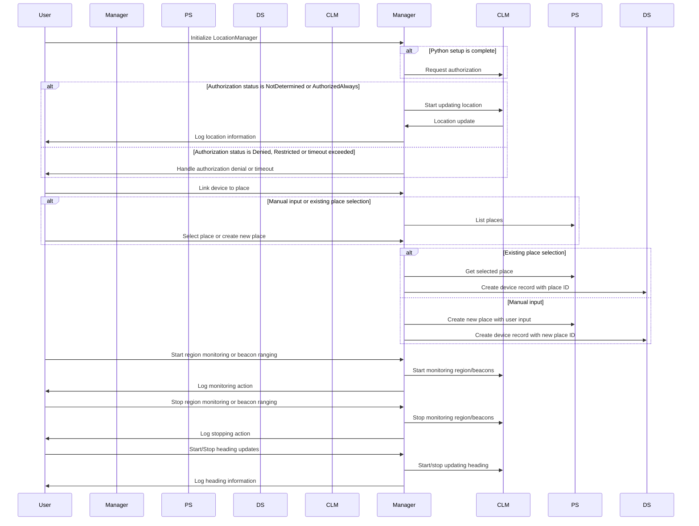

UML (Unified Modeling Language) process diagram that represents the workflow of the provided `LocationManager` class:

1. The user initializes the `LocationManager` class, which sets up necessary components like `PlaceService`, `DeviceService`, and the CLLocationManager delegate.
2. If authorization is not yet determined or authorized (always), the `LocationManager` requests authorization from the user.
3. Upon receiving authorization, the `LocationManager` starts updating the user's location. When a new location update is received, the `LocationManager` logs the latitude and longitude information.
4. If authorization is denied, restricted, or a timeout occurs, the `LocationManager` notifies the user about the failure.
5. The user can request to link a device to a place. Depending on the user's input, they can either select an existing place or create a new one.
6. If an existing place is selected, the `LocationManager` retrieves the selected place from the `PlaceService` and creates a corresponding device record with the place ID in the `DeviceService`.
7. If a new place is created, the `LocationManager` uses user input to create a new place through the `PlaceService` and then creates a device record associated with the new place ID using the `DeviceService`.
8. The user can initiate region monitoring or beacon ranging. Upon receiving these commands, the `LocationManager` starts monitoring regions or beacons using CLRegion and CLBeaconRegion objects, and logs the action.
9. Similarly, the user can stop region monitoring or beacon ranging, which prompts the `LocationManager` to stop monitoring and log the stopping action.
10. The user can request to start or stop heading updates. The `LocationManager` relays these commands to CLLocationManager for starting or stopping heading updates and logs the respective information.