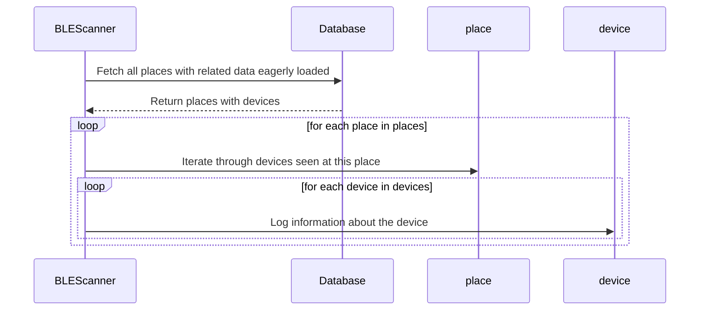
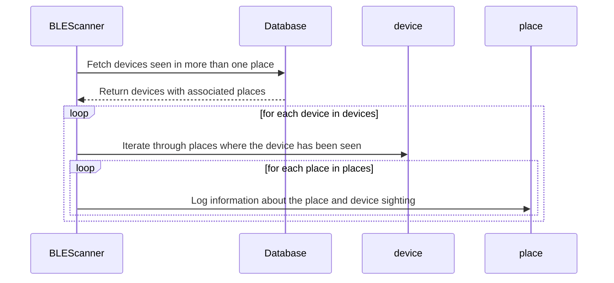

# SWIVEL Scanners Readme 
## Description

This SWIVEL module performs Bluetooth Low Energy Device Detection, GATT Stack Signature Generation, Tracking, and Analysis

1. The `run_scanner()` command is called from the CLI, starting the BLE scanner application.
2. The application creates instances of `LocationManager`, `EventBus`, and `BLEScanner`.
3. The `LocationManager` requests authorization to access location services (not shown in the provided code).
4. The `BLEScanner` initializes its internal variables and starts scanning for BLE devices in a loop using the `scan()` method.
5. During each iteration of the scan loop, the `scan()` method calls the `discover()` function from the `BleakScanner` library to discover nearby BLE devices.
6. For each discovered device, the `scan()` method processes the device, updates or inserts it into the database, records sightings, manages device-place relationships, and logs relevant information. It also finds places for devices based on their geolocation.
7. Periodically during the scan loop, the `report_places_and_devices()` method is called to generate a report of all places and the devices seen at each place.
8. The process repeats until the user stops the scanner or encounters an error.

Analysis is performed during the scan task.
The `BLEScanner` is responsible for scanning and managing devices during the scan task. The `processDevice()` method is called to process each discovered device, while the `updateOrInsertDevice()` method is calledhree main reporting methods: `report_places_and_devices()`, `report_devices_seen_in_multiple_places()`, and `report_devices_seen_in_multiple_places_with_gatt_check()`.

1. `report_places_and_devices()` - Generates a report of all places and the devices seen at each place.

2. `report_devices_seen_in_multiple_places()` - Generates a report of devices that have been seen at multiple different locations.

3. `report_devices_seen_in_multiple_places_with_gatt_check()` - Generates a report of devices that have been seen at multiple different locations, considering devices with matching GATT signatures as potentially the same device despite MAC address randomization.

